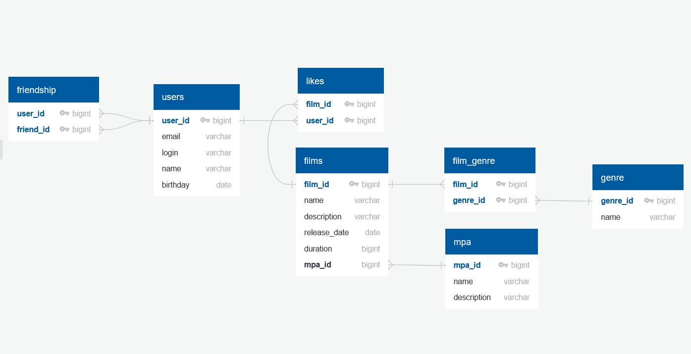

# java-filmorate
Template repository for Filmorate project.

## 📝 Описание схемы
**Основные сущности:**

    Пользователи (users) - хранят профили пользователей

    Фильмы (films) - информация о фильмах

    Рейтинги MPA (mpa_ratings) - возрастные ограничения (G, PG, PG-13 и т.д.)

    Жанры (genres) - категории фильмов (комедия, драма и др.)

    Лайки (likes) - отметки "нравится" от пользователей

    Дружеские связи (friendships) - отношения между пользователями

    Статусы дружбы (friendship_status) - подтверждённая/неподтверждённая дружба

### 🔍 Особенности реализации
**Дружба** требует двустороннего подтверждения (статус `CONFIRMED`)  
В таблице friendships оба поля (user_id и friend_id) являются частью составного первичного ключа, который гарантирует, что каждая дружеская связь будет уникальной в системе.  
Аналогичная ситуация с таблицей film_genres (связь фильмов и жанров) и likes (лайками).  
Наличие составного ключа обеспечивает:  
- уникальность сочетаний  
- быстрый поиск по парам значений

## 🛠 Примеры SQL-запросов

### Добавление нового пользователя:

INSERT INTO users (email, login, name, birthday)
VALUES ('user@example.com', 'user_login', 'User Name', '1990-01-01');

### Получение списка всех пользователей

SELECT * FROM users;

### Добавление нового фильма:

INSERT INTO films (name, description, release_date, duration, mpa_id)
VALUES ('Inception', 'A thief who steals corporate secrets', '2010-07-16', 148, 3);

### Получение топ-10 популярных фильмов:

SELECT f.*, COUNT(l.user_id) AS likes_count
FROM films f
LEFT JOIN likes l ON f.film_id = l.film_id
GROUP BY f.film_id
ORDER BY likes_count DESC
LIMIT 10;

### Получение общих друзей

SELECT u.*
FROM friendships f1
JOIN friendships f2 ON f1.friend_id = f2.friend_id
JOIN users u ON f1.friend_id = u.user_id
WHERE f1.user_id = 1 AND f2.user_id = 2 AND f1.status_id = 2 AND f2.status_id = 2;