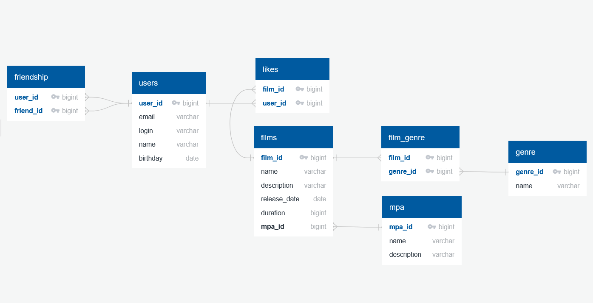

# java-filmorate
Template repository for Filmorate project.  
# Filmorate Database Schema  

# 📝 Описание схемы
## Основные сущности
- **users** - профили пользователей
- **films** - информация о фильмах  
- **mpa_ratings** - возрастные ограничения (G, PG, PG-13, R, NC-17)
- **genres** - категории фильмов
- **likes** - отметки "нравится"
- **friendships** - отношения дружбы
- **friendship_status** - статусы дружбы

## Ключевые особенности
Составные первичные ключи:
   - `friendships(user_id, friend_id)`
   - `film_genres(film_id, genre_id)` 
   - `likes(film_id, user_id)`

Преимущества составных ключей:  
✔️ Гарантируют уникальность сочетаний  
✔️ Обеспечивают быстрый поиск  
✔️ Поддерживают целостность данных  
   
## 🛠 Примеры SQL-запросов

### Добавление нового пользователя:
```sql
INSERT INTO users (email, login, name, birthday)
VALUES ('user@example.com', 'user_login', 'User Name', '1990-01-01');
```
### Получение списка всех пользователей
```sql
SELECT * FROM users;
```
### Добавление нового фильма:
```sql
INSERT INTO films (name, description, release_date, duration, mpa_id)
VALUES ('Inception', 'A thief who steals corporate secrets', '2010-07-16', 148, 3);
```
### Получение топ-10 популярных фильмов:
```sql
SELECT f.*, COUNT(l.user_id) AS likes_count
FROM films f
LEFT JOIN likes l ON f.film_id = l.film_id
GROUP BY f.film_id
ORDER BY likes_count DESC
LIMIT 10;
```
### Получение общих друзей
```sql
SELECT u.*
FROM friendships f1
JOIN friendships f2 ON f1.friend_id = f2.friend_id
JOIN users u ON f1.friend_id = u.user_id
WHERE f1.user_id = 1 AND f2.user_id = 2 AND f1.status_id = 2 AND f2.status_id = 2;
```
